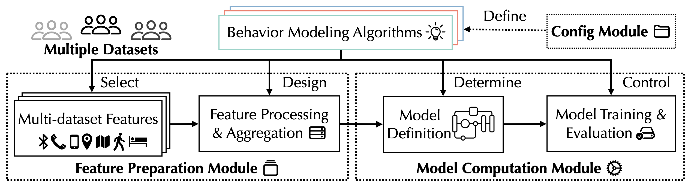

> This is the official codebase of the dataset paper [GLOBEM Dataset: Multi-Year Datasets for Longitudinal Human Behavior Modeling Generalization](https://arxiv.org/abs/2211.02733), accepted by NeurIPS 2022 Dataset and Benchmark Track ([Link](https://arxiv.org/abs/2211.02733))


> This is the official codebase of the platform paper [GLOBEM: Cross-Dataset Generalization of Longitudinal Human
Behavior Modeling](https://orsonxu.com/wp-content/uploads/Projects/GLOBEM/GLOBEM_IMWUT22.pdf), accepted by IMWUT 2023 ([Link](https://orsonxu.com/wp-content/uploads/Projects/GLOBEM/GLOBEM_IMWUT22.pdf))
**🏆 Our paper has won the Distinguished Paper Award @ UbiComp 2023!**

# Introduction

**GLOBEM** is a platform to accelerate cross-dataset generalization research in the longitudinal behavior modeling domain. The name `GLOBEM` is the short for **G**eneralization of **LO**ngitudinal **BE**havior **M**odeling.

GLOBEM not only supports flexible and rapid evaluation of the existing behavior modeling methods, but also provides easy-to-extend templates for researchers to develop and prototype their own behavior modeling algorithms.



GLOBEM currently supports depression detection and closely reimplements the following algorithms[^compatibility]:

* Traditional Machine Learning Algorithm
  - [Trajectories of depression: Unobtrusive monitoring of depressive states by means of smartphone mobility traces analysis](https://doi.org/10.1145/2750858.2805845), by Canzian *et al.*, 2015
  - [Mobile phone sensor correlates of depressive symptom severity in daily-life behavior: An exploratory study](https://doi.org/10.2196/jmir.4273), by Saeb *et al.*, 2015 
  - [Behavior vs. introspection: refining prediction of clinical depression via smartphone sensing data](https://doi.org/10.1109/WH.2016.7764553), by Farhan *et al.*, 2016
  - [Mobile Sensing and Support for People With Depression: A Pilot Trial in the Wild](https://doi.org/10.2196/mhealth.5960), by Wahle *et al.*, 2016 
  - [Joint Modeling of Heterogeneous Sensing Data for Depression Assessment via Multi-task Learning](https://dl.acm.org/doi/10.1145/3191753), by Lu *et al.*, 2018
  - [Tracking Depression Dynamics in College Students Using Mobile Phone and Wearable Sensing](https://dl.acm.org/doi/10.1145/3191775), by Wang *et al.*, 2018
  - [Leveraging Routine Behavior and Contextually-Filtered Features for Depression Detection among College Students](https://doi.org/10.1145/3351274), by Xu *et al.*, 2019
  - [Leveraging Collaborative-Filtering for Personalized Behavior Modeling: A Case Study of Depression Detection among College Students](https://doi.org/10.1145/3448107), by Xu *et al.*, 2021
  - [Detecting Depression and Predicting its Onset Using Longitudinal Symptoms Captured by Passive Sensing](https://doi.org/10.1145/3422821), by Chikersal *et al.*, 2021

* Deep Learning Based Domain Generalization Algorithm
  - [Empirical Risk Minimization (ERM)](https://ieeexplore.ieee.org/abstract/document/788640)
  - Data Manipulation
    - [Mixup](http://arxiv.org/abs/1710.09412), by Zhang *et al.*, 2018
  - Representation Learning
    - [Domain-Adversarial Neural Network (DANN)](https://doi.org/10.1007/978-3-319-58347-1_10), by Ganin *et al.*, 2017
    - [Invariant Risk Minimization (IRM)](http://arxiv.org/abs/1907.02893), by Arjovsky *et al.*, 2020
    - [Common Specific Decomposition (CSD)](http://arxiv.org/abs/2003.12815), by Piratla *et al.*, 2020
  - Learning Strategy
    - [Meta-Learning for Domain Generalization (MLDG)](http://arxiv.org/abs/1710.03463), by Li *et al.*, 2017
    - [Model-Agnostic Learning of Semantic Features (MASF)](http://arxiv.org/abs/1910.13580), by Dou *et al.*, 2019
    - [Siamese Network](http://www.cs.toronto.edu/~gkoch/files/msc-thesis.pdf), by Koch *et al.*, 2015
    - [Reorder](https://orsonxu.com/wp-content/uploads/Projects/GLOBEM/GLOBEM_IMWUT22.pdf), by Xu *et al.*, 2022

# Highlight

## Multi-year Dataset ([`README.md`](./data_raw/README.md))

Along with the GLOBEM, we released the frist multi-year mobile and wearable sensing datasets that contain four data collection studies from 2018 to 2021, covering over 700 person-years from 497 unique users. To download the dataset, please visit our [PhysioNet page](https://physionet.org/content/globem), and [`data_raw/README.md`](./data_raw/README.md) for more details about data format.


The datasets capture various aspects of participants' life experience:


## Benchmark

The table shows the balanced accuracy performance of different algorithms in multiple evaluation setups:


# Tutorial

Below is a brief description of the platform and a simple tutorial on how to use the platform. This tutorial uses depression detection as the longitudinal behavior modeling example.

### TL;DR

Our platform is tested with Python 3.7 under MacOS 11.6 (intel) and CentOS 7. Try the platform with one line of command, assuming Anaconda/miniconda is already installed on the machine. Please find the details of the setup and examples explained in the rest of tutorial.

```
/bin/bash run.sh
```

## Setup

### Environment

GLOBEm is a python-based platform to leverage its flexibility and large number of open libraries. Java JDK (>= 11) is needed for `ml_xu_interpretable`, `ml_xu_personalized`, and `ml_chikersal`. Here is an example of using Anaconda or miniconda for environment setup:

```
conda create -n globem python=3.7
conda activate globem
pip install -r requirements.txt
```

### <a name="dataset_preparation"></a> Dataset Preparation
Example raw data are provided in [`data_raw`](./data_raw) folder[^data]. Each dataset contains `ParticipantsInfoData`, `FeatureData`, and `SurveyData`. Please refer to [`data_raw/README.md`](./data_raw/README.md) for more details about the raw data format.

A simple script is prepared to process these raw data and save a list of files into [`data`](./data) folder. As different subjects may have a different amount of data, the main purpose of the processing is to slice the data into standard <`feature matrix`, `label`> pairs (see [Input](#input) for the definitions). Every dataset contains a list of <`feature matrix`, `label`> pairs, which are saved in a `DatasetDict` object.

The preparation can be done by running (`ETA` ~45 mins with the completed version of the four-year dataset, ~3 mins with the sample data.)
```
python data/data_prep.py
```

## How to run an existing algorithm

The template command:

```
python evaluation/model_train_eval.py
  --config_name=[a model config file name]
  --pred_target=[prediction target]
  --eval_task=[evaluation task]
```

Currently, `pred_target` supports the depression detection task:
- `dep_weekly`: weekly depression status prediction

`eval_task` supports a few single or multiple evaluation setups, such as:
- `single_within_user`: within-user training/testing on a single dataset
- `allbutone`: leave-one-dataset-out setup
- `crosscovid`: pre/post COVID setup, only support certain datasets
- `two_overlap`: train/test on overlapping users between two datasets
- `all`: do all evaluation setups

An example of running [Chikersal *et al.*](./algorithm/ml_chikersal.py)'s algorithm on each dataset to predict weekly depression:

```
python evaluation/model_train_eval.py \
  --config_name=ml_chikersal \
  --pred_target=dep_weekly \
  --eval_task=single_within_user
```

An example of running [Reorder](./algorithm/dl_reorder.py) algorithm with a leave-one-dataset-out setup to predict weekly depression (Note that deep learning algorithms are not compatible with the end-of-term prediction task due to the limited data size):

```
python evaluation/model_train_eval.py \
  --config_name=dl_reorder \
  --pred_target=dep_weekly \
  --eval_task=allbutone
```

The model training and evaluation results will be saved at [`evaluation_output`](./evaluation_output) folder with corresponding path.

In these two examples, they will be saved at `evaluation_output/evaluation_single_dataset_within_user/dep_weekly/ml_chikersal.pkl` and `evaluation_output/evaluation_allbutone_datasets/dep_weekly/dl_reoreder.pkl`, respectively.

Reading the results is straightforward:

```python
import pickle
import pandas, numpy

with open("evaluation_output/evaluation_single_dataset_within_user/dep_weekly/ml_chikersal.pkl", "rb") as f:
    evaluation_results = pickle.load(f)
    df = pandas.DataFrame(evaluation_results["results_repo"]["dep_weekly"]).T
    print(df[["test_balanced_acc", "test_roc_auc"]])

with open("evaluation_output/evaluation_allbutone_datasets/dep_weekly/dl_reorder.pkl", "rb") as f:
    evaluation_results = pickle.load(f)
    df = pandas.DataFrame(evaluation_results["results_repo"]["dep_weekly"]).T
    print(df[["test_balanced_acc", "test_roc_auc"]])
```

Please refer to [`analysis/prediction_results_analysis.ipynb`](./analysis/prediction_results_analysis.ipynb) for more examples of results processing.

### Code Breakdown

The two examples above are equivalent to the following code blocks:

[Chikersal *et al.*](./algorithm/ml_chikersal.py)'s algorithm doing the single dataset evaluation task:
```python
import pandas, numpy
from data_loader import data_loader_ml
from utils import train_eval_pipeline
from algorithm import algorithm_factory

ds_keys = ["INS-W_1", "INS-W_2", "INS-W_3", "INS-W_4"] # list of datasets to be included
pred_targets = ["dep_weekly"] # list of prediction task
config_name = "ml_chikersal" # model config

dataset_dict = data_loader_ml.data_loader(ds_keys_dict={pt: ds_keys for pt in pred_targets})
algorithm = algorithm_factory.load_algorithm(config_name=config_name)
evaluation_results = train_eval_pipeline.single_dataset_within_user_driver(
    dataset_dict, pred_targets, ds_keys, algorithm, verbose=0)

df = pandas.DataFrame(evaluation_results["results_repo"][pred_targets[0]]).T
print(df[["test_balanced_acc", "test_roc_auc"]])
```

<table>
    <tr style="font-weight:bold">
        <td rowspan="2" align="left">Model</td>
        <td colspan="4" align="center">Balanced Accuracy</td>
        <td colspan="4" align="center">ROC AUC</td>
    </tr>
    <tr style="font-weight:bold"> <td>INS-1</td> <td>INS-2</td> <td>INS-3</td> <td>INS-4</td> <td>INS-1</td> <td>INS-2</td> <td>INS-3</td> <td>INS-4</td> </tr>
    <tr> <td>Chikersal et al.</td> <td>0.656</td> <td>0.611</td> <td>0.641</td> <td>0.690</td> <td>0.726</td> <td>0.679</td> <td>0.695</td> <td>0.763</td> </tr>
</table>

[Reorder](./algorithm/dl_reorder.py) algorithm doing the leave-one-dataset-out generalization task:

```python
import pandas
from data_loader import data_loader_dl
from utils import train_eval_pipeline
from algorithm import algorithm_factory

ds_keys = ["INS-W_1", "INS-W_2", "INS-W_3", "INS-W_4"] # list of datasets to be included
pred_targets = ["dep_weekly"] # list of prediction task
config_name = "dl_reorder" # model config

dataset_dict = data_loader_dl.data_loader_dl_placeholder(pred_targets, ds_keys)
algorithm = algorithm_factory.load_algorithm(config_name=config_name)
evaluation_results = train_eval_pipeline.allbutone_datasets_driver(
    dataset_dict, pred_targets, ds_keys, algorithm, verbose=0)

df = pandas.DataFrame(evaluation_results["results_repo"][pred_targets[0]]).T
print(df[["test_balanced_acc", "test_roc_auc"]])
```

<table>
    <tr style="font-weight:bold">
        <td rowspan="2" align="left">Model</td>
        <td colspan="4" align="center">Balanced Accuracy</td>
        <td colspan="4" align="center">ROC AUC</td>
    </tr>
    <tr style="font-weight:bold"> <td>INS-1</td> <td>INS-2</td> <td>INS-3</td> <td>INS-4</td> <td>INS-1</td> <td>INS-2</td> <td>INS-3</td> <td>INS-4</td> </tr>
    <tr> <td>Reorder</td> <td>0.548</td> <td>0.542</td> <td>0.530</td> <td>0.568</td> <td>0.567</td> <td>0.564</td> <td>0.552</td> <td>0.571</td> </tr>
</table>

There are also some additional evaluation parameters that can be set through config files. Please refer to [`config/README.md`](./config/README.md).

Some intermediate files may be saved in [`tmp`](./tmp/) folder to accelerate repeated testing (`tmp` folder also includes some example code and auxiliary materials). The evaluation results will be saved as a pkl file in [`evaluation_output`](./evaluation_output) at the corresponding path.

### From sample data to full data

By default, the platform is running on sample data from the datasets.

To switch to the full data, please follow the following simple steps:
1. Access and download the completed data from [the PhysioNet page](https://physionet.org/content/globem).
2. Unzip the downloaded data and put the datasets (each one is a unique folder) into [`data_raw`](./data_raw/). Please refer to [`data_raw/README.md`](./data_raw/README.md) for more dataset details.
3. Go to [`config/global_config.py`](./config/global_config.py) to set `global_config["all"]["ds_keys"]` by commenting `line7` and uncommenting `line6`.

## <a name="platform_description"></a>Platform Description

GLOBEM provides three major modules and a few utility functions:
1. Feature Preparation Module
2. Model Computatoin Module
3. Configuration Module

Each algorithm (`DepressionDetectionAlgorithmBase` defined in [`algorithm/base.py`](./algorithm/base.py)) consists of these three modules to form a complete pipeline that leads to one (or more) machine learning models: from feature preparation (as model input) to model computation (to obtain model output), with parameters controlled by the configuration module.

### <a name="input"></a> Input

After dataset preparation (as explained in [Dataset Preparation](#dataset_preparation) section), an initial input data point will be a standard <`feature matrix`, `label`> pair.

`label`: the ground truth (currently, it is a binary label) indicating a subject's self-report depressive symptom status on a certain date.

`feature matrix`: given the date of the `label`, the feature matrix includes daily feature vectors in the past four weeks, with the dimension as `(28, # of features)`.

### <a name="module_feature_prep"></a> Feature Preparation Module

This module defines the features used by the algorithm as the input. The function `DepressionDetectionAlgorithmBase.prep_data_repo` determines this process of an algorithm.

For traditional machine learning algorithms, this can be basic feature selection, aggregation, and filtering (*e.g.,* mean, std) along the feature matrix's temporal dimension (*e.g.,* [Canzian *et al.*](./algorithm/ml_canzian.py), [Saeb *et al.*](./algorithm/ml_saeb.py)), or complex feature extraction (*e.g.,* [Xu *et al.*](./algorithm/ml_xu_interpretable.py), [Chikersal *et al.*](./algorithm/ml_chikersal.py)).

For deep learning algorithms, this is a definition of a feature data feeding process (*i.e.,* a data generator) that prepares data for deep model training (*e.g.,* [ERM](./algorithm/dl_erm.py)).

### <a name="module_model_computation"></a> Model Computation Module

This module defines the model construction and training process. The function `DepressionDetectionAlgorithmBase.prep_model` determines a prediction model generated by the algorithm. The `prep_model` function will return a `DepressionDetectionClassifierBase` object that specifies the model design, training, and prediction process.

For traditional machine learning algorithms, this can be some off-the-shelf model such as an SVM (*e.g.,* [Farhan *et al.*](./algorithm/ml_farhan.py)), or some customized statistical model (*e.g.,* [Lu *et al.*](./algorithm/ml_lu.py)) that is ready to be trained with input data.

For deep learning algorithms, this is a definition of deep modeling architecture and training process (*e.g.,* [IRM](./algorithm/dl_irm.py)), and builds a deep model that is ready to be trained with input data.

#### Multiple Models from One Algorithm

It is worth noting that one algorithm can define multiple models. For example, [ERM](./algorithm/dl_erm.py) can use different deep learning architectures such as ERM-1D-CNN, ERM-2D-CNN, ERM-Transformer; [DANN](./algorithm/dl_dann.py) can take each dataset as a domain (DANN-dataset as domain), or each person as a domain (DANN-person as domain).

### <a name="module_config"></a> Configuration Module

This module provides the flexibility of controlling different parameters in the [Feature Preparation Module](#module_model_computation) and [Model Computation Module](#module_model_computation). Each algorithm has its own unique parameters that can be added to this module.

The platform employs a simple `yaml` file system. Each model (*NOT algorithm*) has its own unique config yaml file in [`config`](./config) folder with a unique file name. For example, [Chikersal *et al.*](./algorithm/ml_chikersal.py) can have one model, and its config file is [`config/ml_chikersal.yaml`](./config/ml_chikersal.yaml); [DANN](./algorithm/dl_dann.py) can have two models, so it has two config files: [`config/dl_dann_ds_as_domain.yaml`](./config/dl_dann_ds_as_domain.yaml) and [`config/dl_dann_person_as_domain.yaml`](./config/dl_dann_person_as_domain.yaml), respectively.


## Extending the Platform

### How to add a new algorithm

The platform supports researchers in developing their own algorithms easily. Reading through [Platform Description](#platform_description) before implementing new algorithms is highly recommended.

An algorithm just needs to extend the abstract class [`DepressionDetectionAlgorithmBase`](./algorithm/base.py) and implement:
1. Define the function `prep_data_repo` (as the feature preparation module)
    It takes in `DatasetDict` as the input and returns a `DataRepo` object (see [here](./data_loader/data_loader_ml.py)), which is a simple data object that saves `X`, `y`, and `pids` (participant ids). This can be used for preparing both training and testing sets. 
2. Define the function `prep_model` (as the model computation module)
    It returns a `DepressionDetectionClassifierBase` object (see [here](./algorithm/base.py)), which needs to support `fit` (model training), `predict` (model prediction), and `predict_proba` (model prediction with probability distribution).
3. Add a configuration file in `config` (as the configuration module)
    At least one yaml file with a unique name needs to be put in the [`config`](./config) folder. The config file will contain controllable parameters that can be adjusted manually. Please refer to [`config/README.md`](./config/README.md) for more details.
4. Register the new algorithm in [`algorithm/algorithm_factory.py`](./algorithm/algorithm_factory.py) by adding appropriate class import and if-else logic.

#### How to add a traditional machine learning algorithm

We provide a basic traditional machine learning algorithm  [`DepressionDetectionAlgorithm_ML_basic`](./algorithm/ml_basic.py) that extends `DepressionDetectionAlgorithmBase`.

Its `prep_data_repo` function 1. takes the feature vector at the same day of the collected label, 2. performs a feature normalization, 3. filters empty features and days with a large amount of missing data, 4. imputes the rest of the missing data using median, 5. puts the data into a `DataRepo` and return it.

Its `prep_model` function is left empty for custom implementation.

This object can serve as a starting point and other traditional ML algorithms can extend [`DepressionDetectionAlgorithm_ML_basic`](./algorithm/ml_basic.py). For example, the implementation of [Saeb *et al.*](https://doi.org/10.2196/jmir.4273)'s algorithm can be found [`algorithm/ml_saeb.py`](./algorithm/ml_saeb.py) and [`config/ml_saeb.yaml`](./config/ml_saeb.yaml)

#### How to add a deep learning algorithm

We use ERM ([`algorithm/dl_erm.py`](./algorithm/dl_erm.py)) as the basic deep learning algorithm [`DepressionDetectionAlgorithm_DL_erm`](./algorithm/dl_erm.py) that extends `DepressionDetectionAlgorithmBase`.

Its `prep_data_repo` function prepares a set of data loaders [`MultiSourceDataGenerator`](./data_loader/data_loader_dl.py) as training&validation or testing set, puts them into a `DataRepo` and returns it.

Its `prep_model` function defines a standard deep-learning classifier [`DepressionDetectionClassifier_DL_erm`](./algorithm/dl_erm.py) that extends `DepressionDetectionClassifierBase` and defines how a deep model should be trained, saved, and evaluated. The training setup is parameterized in config files such as [`config/dl_erm_1dCNN.yaml`](./config/dl_erm_1dCNN.yaml).

This algorithm can serve as a starting point, and other DL algorithms can extend `DepressionDetectionAlgorithm_DL_erm` and `DepressionDetectionClassifier_DL_erm`. For example, the implementation of [IRM](http://arxiv.org/abs/1907.02893) algorithm can be found at [`algorithm/dl_irm.py`](./algorithm/dl_irm.py) and [`config/dl_irm.yaml`](./config/dl_irm.yaml).

For both traditional ML and DL algorithms, it is also possible to start from the plain `DepressionDetectionAlgorithmBase` and `DepressionDetectionClassifierBase`.

### How to add a new dataset

To include a new dataset in the pipeline, it needs to do the following steps:
1. Define the name of the new dataset with the template `[group name]_[dataset NO in the group]`, *e.g.,* `ABC_1`.
2. Following the same structure as other dataset folders in `data_raw`, the new dataset folder (*e.g.,*, `ABC_1`) needs to contain three subfolders. Please refer to [`data_raw/README.md`](./data_raw/README.md) for more details:
   - `FeatureData`: a csv file `rapids.csv` indexed by `pid` and `date` for feature data, and separate files `[data_type].csv` indexed by `pid` and `date` for each data type. Each row is a feature vector of a subject at a given date. Example columns: [`pid`, `date`, `feature1`, `feature2`...].
   Columns include all sensor features of *Phone Location*, *Phone Screen*, *Calls*, *Bluetooth*, *Fitbit Steps*, and *Fitbit Sleep* from [RAPIDS toolkit](https://www.rapids.science/1.6/)[^rapids].
   - `SurveyData`: csv files indexed by `pid` and `date` for label data. For depression detection, there are two files: `dep_weekly.csv` and `dep_endterm.csv`. For other tasks, there are three files: `pre.csv`, `post.csv`, and `ema.csv`.
   - `ParticipantsInfoData`: a csv file `platform.csv` indexed by `pid` for data collection device platform (*i.e.,* iOS or Android). Example columns of the file: [`pid`, `platform`].
3. Register the new path in [`data/data_factory.py`](./data/data_factory.py) by adding new key-value pairs in the following dictionaries: `feature_folder`, `survey_folder`, and `device_info_folder` (*e.g.,* adding `{"ABC": {1: ...}}`).
4. Register the new dataset key into the [`config/global_config.yaml`](./config/global_config.yaml) into `global_config["all"]["ds_keys"]` (*e.g.,* appending `"ABC_1"`).

### How to add a new modeling target

Our current platform only supports binary classification tasks. Future work will be needed to extend to multi-classification and regression tasks. To build a model for a new target other than depression detection, it needs to do the following steps:
1. Pick a column in either `ema.csv`, or `post.csv` (see [`data_raw/README.md`](./data_raw/README.md) for more details) as the target name. Note that the picked column needs to be consistent across all datasets defined in [`config/global_config.yaml`](./config/global_config.yaml). A column in `pre.csv` would also work as long as the date can be handled correctly. Here `UCLA_10items_POST` from `post.csv` is used as an example, a metric measuring loneliness.
2. Define the binary label for the target in [`data/data_factory.py`](./data/data_factory.py)'s `threshold_book`. A simple threshold based method is used to add a `key:value` pair to the `threshold_book`, where `key` is the target name and `value` is a dionctionary `{"threshold_as_false": th1, "threshold_as_true":th2}` (note that `th1` != `th2`).
For example, for `UCLA_10items_POST`, scores <= 24 will be defined as `False`, and scores >= 25 will be `True`. This corresponds to adding the following `key:value` pair to the `threshold_book`: `"UCLA_10items_POST": {"threshold_as_false": 24, "threshold_as_true":25}`. 
3. Define it in the [`config/global_config.yaml`](./config/global_config.yaml) to involve it in the pipeline. Replace `global_config["all"]["prediction_tasks"]` to be `[the new target]`. Continuing the example, it will be `["UCLA_10items_POST"]`.

# Contributing

This project adopts [Apache License 2.0](./LICENSE) and welcomes contributions and suggestions. We look forward to researchers extending the platform with new algorithms and datasets.


[^compatibility]:
    Feature overlap is maximized during the implementation. For features that are not consistently available, they are excluded to ensure compatibility.

[^data]:
    We use sample data for testing purpose.

[^rapids]:
    Assuming that the new dataset was collected using the [AWARE framework](https://awareframework.com/) so that it can be processed by [RAPIDS](https://www.rapids.science/1.6/) directly. Otherwise, additional data transformation is needed before applying RAPIDS.

# Citation

If you find the dataset/codebase helpful in your research, please cite the following paper.

```
@inproceedings{
    xu2022globem_neurips,
    title={{GLOBEM} Dataset: Multi-Year Datasets for Longitudinal Human Behavior Modeling Generalization},
    author={Xuhai Xu and Han Zhang and Yasaman S Sefidgar and Yiyi Ren and Xin Liu and Woosuk Seo and Jennifer Brown and Kevin Scott Kuehn and Mike A Merrill and Paula S Nurius and Shwetak Patel and Tim Althoff and Margaret E Morris and Eve A. Riskin and Jennifer Mankoff and Anind Dey},
    booktitle={Thirty-sixth Conference on Neural Information Processing Systems Datasets and Benchmarks Track},
    year={2022},
    url={https://arxiv.org/abs/2211.02733}
}

@article{
    xu2022globem_imwut,
	title = {{GLOBEM}: {Cross}-{Dataset} {Generalization} of {Longitudinal} {Human} {Behavior} {Modeling}},
	volume = {6},
	number = {4},
	journal = {Proceedings of the ACM on Interactive, Mobile, Wearable and Ubiquitous Technologies},
	author = {Xu, Xuhai and Liu, Xin and Zhang, Han and Wang, Weichen and Nepal, Subgiya and Kuehn, Kevin S and Huckins, Jeremy and Morris, Margaret E and Nurius, Paula S and Riskin, Eve A and Patel, Shwetak and Althoff, Tim and Campell, Andrew and Dey, Anind K and Mankoff, Jennifer},
	year = {2022}
}
```
